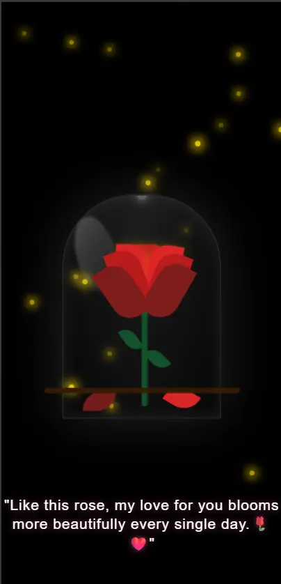

## Rose Day Animated Hero

A small Vite + React experience that showcases an animated rose under a glass dome with glowing fireflies and a timed quote reveal. It is fully responsive for mobile and desktop.

### Features
- Animated rose petals with staggered pop-up and falling sequences
- Glass dome highlight with glowing fireflies
- Timed quote reveal for Rose Day
- Responsive layout tuned for tablets, small phones, and extra-small phones

### Screenshots


### Tech Stack
- React 19
- Vite 7
- CSS animations (no extra UI libraries)

### Getting Started
1) Install dependencies
```bash
npm install
```
2) Run the dev server
```bash
npm run dev
```
3) Build for production
```bash
npm run build
```

### Key Files
- App entry: [src/App.jsx](src/App.jsx)
- Hero component: [src/components/Hero.jsx](src/components/Hero.jsx)
- Styling and responsive breakpoints: [src/components/Hero.css](src/components/Hero.css)

### Customization
- Update the Rose Day quote in [src/components/Hero.jsx](src/components/Hero.jsx) inside the `rose-quote` block.
- Adjust animation timing or breakpoints in [src/components/Hero.css](src/components/Hero.css).

### Scripts
- `npm run dev` — start local dev server
- `npm run build` — production build
- `npm run preview` — preview the production build
- `npm run lint` — lint the project

### Notes
- Designed for modern browsers with CSS animations enabled.
- To deploy, build with `npm run build` and host the `dist` output on any static host.
